author: B103040012 
date: 2022/4/1
# Part1
1. Explain what memory-mapped I/O is and how it works.  

__ans:__  
memory-mapped I/O is a method that use the same address space to address both memory and I/O devices.  
it maps the memory and registers of the device to a address value. if use this method, the OS can treat the device as a file.

2. Explain what DMA is and how it works.  

__ans:__  
DMA is scheme which relieve the burden of CPU when doing I/O operation.  
when access a device, CPU will waste lots of time for the entire duration of the read or write operation.  
but with DMA, CPU first initiates the transfer, and then let DMA controller deal with all the I/O issue.  
before the interrupt from the DMA controller(which means the transfer is done), the CPU can perform with other operation.  
so that, the waiting time won't be wasted.

3. Consider the following set of processes, with the length of the CPU-burst time given in milliseconds:  

| Process | Burst Time | Priority |
|-------|----------|--------|
|  $P1$  |     8      |    4     |
|  $P2$  |     1      |    1     |
|  $P3$  |     2      |    3     |
|  $P4$  |     1      |    5     |
|  $P5$  |     6      |    2     |

The processes are assumed to have arrived in the order $P1 , P2 , P3 , P4 , P5$, all at time $0$.  

ans:  

(a)
(a)

```mermaid
gantt
    title Gantt charts
    dateFormat  s
        axisFormat  %S
        section FCFS
            P1 :a1, 0, 8s
            P2 :a2, after a1, 1s
            P3 :a3, after a2, 2s
            P4 :a4, after a3, 1s
            P5 :a5, after a4, 6s
    
        section SJF
            P2           :b2, 0, 1s
            P4           :b4, after b2  , 1s
            P3           :b3, after b4  , 2s
            P5           :b5, after b3  , 6s
            P1           :b1, after b5, 8s
            
        section priority
            P2           :c2, 0, 1s
            P5           :c5, after c2  , 6s
            P3           :c3, after c5  , 2s
            P1           :c1, after c3, 8s
            P4           :c4, after c1  , 1s
    
        section RR
            P1           :d1, 0, 1s 
            P2           :d2, after d1  , 1s
            P3           :d3, after d2  , 1s
            P4           :d4, after d3  , 1s
            P5           :d5, after d4  , 1s
            P1           :d6, after d5  , 1s
            P3           :d7, after d6  , 1s
            P5           :d8, after d7  , 1s
            P1           :d9, after d8  , 1s
            P5           :d10, after d9  , 1s
            P1           :d11, after d10  , 1s
            P5           :d12, after d11  , 1s
            P1           :d13, after d12  , 1s
            P5           :d14, after d13  , 1s
            P1           :d15, after d14  , 1s
            P5           :d16, after d15  , 1s
            P1           :d17, after d16  , 2s
```

(b)
|       | FCFS | SJF | priority | RR |  
|-----|----|:---:|:--------:|:--:|  
| $P1$ |  8   | 18  | 17       | 18 |  
| $P2$ |  9   |  1  |  1       |  2 |  
| $P3$ | 11 	 |  4	 |  9	      |  7 |  
| $P4$ | 12 	 |  2  | 18       |  4 |  
| $P5$ | 18   | 10  |  7       | 16 |  

(c)
|       | FCFS | SJF | priority | RR |  
|----|:----:|:---:|:--------:|:--:|  
| $P1$ |  0   | 10  |  9       | 10 |  
| $P2$ |  8   |  0  |  0       |  1 |  
| $P3$ |  9	 |  2	 |  7	      |  5 |  
| $P4$ | 11 	 |  1  | 17       |  3 |  
| $P5$ | 12   |  4  |  1       | 10 |  

(d)
it's SJF, whose total waiting time is 17.

4. A UNIX process has two parts—the user part and the kernel part. Is the kernel part like a subroutine and a coroutine? Why?  

ans:  
more like a subroutine, since when the user process require a kernel service, the kernel space starts at the same place.  
however, a coroutine can stop and resume its job at the same place.
